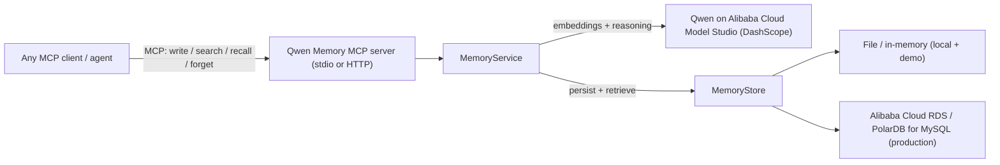
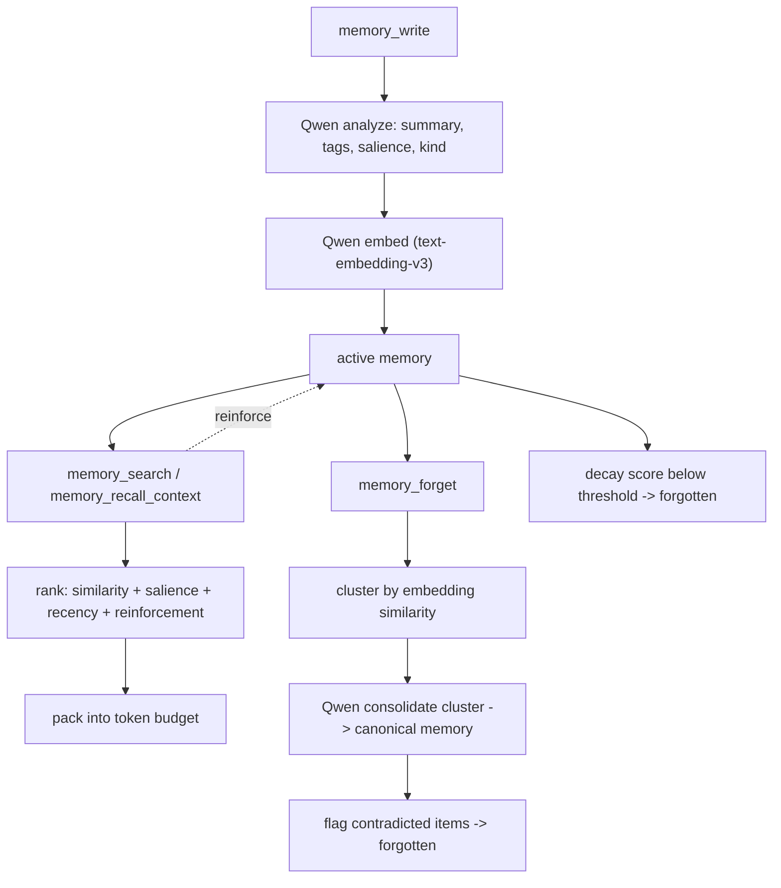

# Qwen Memory MCP

Long-term memory for AI agents, powered by Qwen on Alibaba Cloud and exposed
over the [Model Context Protocol (MCP)](https://modelcontextprotocol.io). Any
MCP-capable agent gains durable, cross-session memory that **accumulates**
experience, **retrieves** what matters within a limited context window, and
**forgets** what is outdated.

> Hackathon track: **Track 1 - MemoryAgent**. License: MIT. Copyright (c) 2026 JHELY GLOBAL SL.

**Repository:** https://github.com/John-CEO-HQ/qwen-memory-mcp

This project is a **learning experiment** for the Qwen Cloud Hackathon: a standalone MCP server for agent memory on Alibaba Cloud.

## Documentation

| Guide | Purpose |
|-------|---------|
| [docs/TESTING-GUIDE.md](docs/TESTING-GUIDE.md) | Master index: testing and hackathon checklist |
| [docs/CREDENTIALS-AND-SETUP.md](docs/CREDENTIALS-AND-SETUP.md) | Accounts, API keys, regions, cost guardrails |
| [docs/PHASE1-REMOTE-INTEGRATION.md](docs/PHASE1-REMOTE-INTEGRATION.md) | Live Qwen / DashScope tests from your machine |
| [docs/PHASE2-DEPLOYMENT-TESTING.md](docs/PHASE2-DEPLOYMENT-TESTING.md) | Alibaba deploy + verify deployed URL |
| [docs/INSTALL.md](docs/INSTALL.md) | Full install, local run, Alibaba production deploy, troubleshooting |
| [docs/JUDGE-TESTING.md](docs/JUDGE-TESTING.md) | Instructions for hackathon judges |
| [deploy/README.md](deploy/README.md) | Alibaba ECS / Function Compute quick reference |
| [AGENTS.md](AGENTS.md) | Agent conventions and isolation contract |

## Why

Agents feel sharp inside a single conversation and amnesiac across sessions.
This server gives an agent a managed memory layer that does four things well:

- **Write** - extract a durable memory (preference, fact, commitment, event),
  with a Qwen-derived summary, tags, importance (salience), and kind.
- **Search** - semantic retrieval ranked by similarity + salience + recency +
  reinforcement.
- **Recall context** - pack the most critical memories into a fixed token
  budget, ready to inject into a small context window.
- **Forget** - a maintenance pass that consolidates related memories with Qwen
  and lets stale, low-value memories decay away.

## Architecture



Memory lifecycle:



## Quick start

```bash
npm install

# Offline demo (no API key needed - deterministic local intelligence):
npm run demo

# Run the test suite:
npm test

# Run as an MCP server over stdio (for MCP Inspector / desktop clients):
npm run build && npm start
```

To use the real Qwen models, copy `.env.example` to `.env` and set
`QWEN_API_KEY` (and optionally `QWEN_BASE_URL` for your region). Without a key,
the server automatically falls back to the offline deterministic intelligence
so it always runs.

## MCP tools

| Tool | Purpose | Key inputs |
|------|---------|------------|
| `memory_write` | Persist a durable memory | `userId`, `content`, `sourceSession?`, `salience?` |
| `memory_search` | Top-k semantic recall | `userId`, `query`, `k?` |
| `memory_recall_context` | Critical memories packed to a token budget | `userId`, `query`, `tokenBudget` |
| `memory_forget` | Consolidate + decay maintenance | `userId` |

All memories are namespaced by `userId`, so one server can serve many agents.

## Transports

- **stdio** (`MCP_TRANSPORT=stdio`, default) - launched as a child process by a
  local MCP client.
- **Streamable HTTP** (`MCP_TRANSPORT=http`) - stateless JSON-RPC at `POST /mcp`
  with optional `Authorization: Bearer <MCP_AUTH_TOKEN>`, plus `GET /health`.
  This is the shape used for cloud deployment and remote per-user MCP URLs.

## Storage

- `MEMORY_STORE=memory` - in-process, ephemeral (tests/demo).
- `MEMORY_STORE=file` - single JSON file at `MEMORY_FILE_PATH` (local default).
- `MEMORY_STORE=mysql` - Alibaba Cloud RDS / PolarDB for MySQL (production);
  schema is created automatically. Vectors are stored as JSON and scored in the
  app; see [`src/memory/mysql-store.ts`](src/memory/mysql-store.ts) for the
  AnalyticDB-PG (pgvector) upgrade path.

## Alibaba Cloud / Qwen

The only integration points with Alibaba Cloud are
[`src/qwen.ts`](src/qwen.ts) (DashScope embeddings + chat) and
[`src/memory/mysql-store.ts`](src/memory/mysql-store.ts) (RDS/PolarDB). See
[docs/INSTALL.md](docs/INSTALL.md) for full production setup and
[deploy/README.md](deploy/README.md) for a short Alibaba quick reference.

## Configuration

See [`.env.example`](.env.example) for all variables (Qwen models, store
selection, transport, auth token, and forgetting/decay tuning).

## Layout

```
qwen-memory-mcp/
  src/
    qwen.ts               # Alibaba Cloud / Qwen (DashScope) intelligence  [PROOF]
    fake-intelligence.ts  # offline deterministic intelligence (tests/demo)
    intelligence.ts       # picks Qwen vs fake
    config.ts             # env-driven config
    types.ts              # domain types
    memory/
      store.ts            # MemoryStore interface
      file-store.ts       # file / in-memory store
      mysql-store.ts      # Alibaba RDS / PolarDB store               [PROOF]
      create-store.ts     # store factory
      ranking.ts          # retrieval ranking + token-budget packing
      forgetting.ts       # clustering + consolidation + decay
      service.ts          # MemoryService (orchestration)
    server.ts             # MCP server + 4 tools
    transports/
      stdio.ts            # stdio transport
      http.ts             # streamable HTTP transport (stateless)
    index.ts              # entry point
  demo/cli.ts             # multi-session offline demo
  test/                   # vitest suite
  deploy/                 # Alibaba Cloud deployment docs
  Dockerfile
```

## License

MIT License. Copyright (c) 2026 JHELY GLOBAL SL. See [LICENSE](LICENSE).
