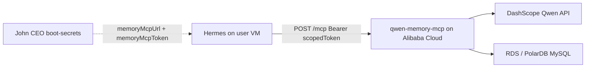

# John CEO integration guide

> **Status: documented, not yet implemented.** This module is intentionally
> isolated from John CEO core today. Nothing in `functions/` or `app/` depends
> on `qwen-memory-mcp/` yet. This document is the blueprint for a future,
> additive PR.

How to plug the deployed **Qwen Memory MCP** server into John CEO so Hermes
agents on user VMs gain long-term, cross-session memory.

For install and Alibaba deployment, see [INSTALL.md](INSTALL.md).

---

## Integration model: direct MCP URL

The VM's Hermes gateway connects **directly** to the memory server over HTTP.
John CEO boot-secrets hand each user a scoped bearer token and the MCP URL.
The Qwen API key stays on Alibaba Cloud only.



This mirrors how Composio MCP is wired today, except:

| | Composio | Qwen Memory |
|---|----------|-------------|
| MCP URL target | Control-plane proxy `/api/mcp/:clientId` | External Alibaba host `/mcp` |
| Platform secret on backend | `COMPOSIO_API_KEY` (control plane) | `QWEN_API_KEY` (memory server on Alibaba) |
| VM receives | `composioMcpToken` (scoped bearer) | `memoryMcpToken` (scoped bearer) |
| User namespace | Composio `user_id` = `clientId` | MCP tool `userId` = `clientId` |

---

## Prerequisites

1. **Memory server deployed** on Alibaba Cloud with HTTP transport. See
   [INSTALL.md](INSTALL.md) and [deploy/README.md](../deploy/README.md).
2. **Reachable from Hetzner VMs** - the memory server's HTTPS URL must be
   reachable from user workspaces (public internet or allowlisted egress).
3. **Per-user auth strategy** - mint a scoped bearer per user at boot (recommended;
   mirror Composio's `rotateMcpToken` pattern) or use a shared server token
   with strict `userId` namespacing (weaker isolation).

---

## Security (PRD-aligned)

John CEO's cross-cutting law: **no platform secret ever lands on a user VM.**

| Secret | Where it lives | Reaches VM? |
|--------|----------------|-------------|
| `QWEN_API_KEY` | Memory server env on Alibaba Cloud | **No** |
| `MYSQL_PASSWORD` | Memory server env on Alibaba Cloud | **No** |
| `memoryMcpToken` | Boot-secrets -> VM `config.yaml` | **Yes** (scoped bearer, like Composio) |
| `memoryMcpUrl` | Boot-secrets -> VM `config.yaml` | **Yes** (public HTTPS endpoint) |

The VM agent passes `userId` = John CEO `clientId` on every memory tool call.
That namespaces memories per user on the shared memory server.

Verify after integration: `QWEN_API_KEY` must **not** appear in `/opt/data/.env`
on the VM.

---

## Future PR checklist (John CEO core)

All changes are **additive**. Do not import code from `qwen-memory-mcp/` into
`functions/`. The open-source module stays a separate deployable service.

Paths below are relative to the **John CEO monorepo root** (parent of this
folder).

### 1. Platform config

**File:** `functions/_lib/env.ts`

Add optional control-plane-only env vars:

```typescript
// Base URL of the deployed qwen-memory-mcp HTTP endpoint (no trailing slash).
// Example: https://memory.example.aliyuncs.com
QWEN_MEMORY_MCP_URL: string | undefined;
```

When unset, boot-secrets omit memory MCP fields (feature off).

### 2. Boot secrets contract

**File:** `functions/_lib/contracts/boot.ts`

Extend `BootSecretsResponse`:

```typescript
// Present when QWEN_MEMORY_MCP_URL is configured.
memoryMcpUrl: z.string().url().optional(),
memoryMcpToken: z.string().optional(),
```

Regenerate OpenAPI (`pnpm openapi:dump`) and update integration tests.

### 3. Boot secrets handler

**File:** `functions/routes/boot.ts`

When `env.QWEN_MEMORY_MCP_URL` is set:

1. Mint or rotate a per-user bearer token (same semantics as Composio:
   `functions/_lib/composio/mcp-token.ts` - either reuse that table with a
   `kind` column or add `memory_mcp_tokens`).
2. Return in the secrets JSON:

```json
{
  "memoryMcpUrl": "https://<host>/mcp",
  "memoryMcpToken": "<scoped-bearer>"
}
```

The memory server validates `MCP_AUTH_TOKEN` on each request. Options:

- **Per-user tokens:** memory server accepts any active token from a shared
  secret store (requires memory server auth extension), OR
- **Single server token + userId:** simpler v1 - one `MCP_AUTH_TOKEN` on the
  memory server; John CEO mints per-user tokens that the memory server maps
  (future) or uses the same platform token server-side only and passes
  `clientId` as `userId` in tool calls from a trusted VM.

**Recommended v1 (simplest):** memory server has one `MCP_AUTH_TOKEN`. John CEO
stores the same token control-plane-side only and injects it into boot-secrets
as `memoryMcpToken` (rotated per boot like Composio). VM is trusted to pass
correct `userId`. Qwen key still never reaches VM.

### 4. Cloud-init: parse secrets

**File:** `functions/_lib/hermes/cloud-init.ts`

After the existing `COMPOSIO_MCP_TOKEN` parse block (~line 208), add:

```bash
MEMORY_MCP_URL=$(printf '%s' "$SECRETS_JSON" | jq -r '.memoryMcpUrl // empty')
MEMORY_MCP_TOKEN=$(printf '%s' "$SECRETS_JSON" | jq -r '.memoryMcpToken // empty')
```

Do **not** write `QWEN_API_KEY` to the VM env file.

### 5. Cloud-init: register MCP server in config.yaml

**File:** `functions/_lib/hermes/cloud-init.ts`

After the Composio `mcp_servers.composio` block (~lines 387-392), append when
token and URL are present:

```bash
if [ -n "$MEMORY_MCP_URL" ] && [ -n "$MEMORY_MCP_TOKEN" ] && [ -f /mnt/hermes/data/config.yaml ]; then
  {
    printf '%s\n' "  qwen_memory:"
    printf '%s\n' "    url: $MEMORY_MCP_URL"
    printf '%s\n' "    headers:"
    printf '%s\n' "      Authorization: \"Bearer $MEMORY_MCP_TOKEN\""
  } >> /mnt/hermes/data/config.yaml
fi
unset MEMORY_MCP_TOKEN
```

Resulting `config.yaml` fragment:

```yaml
mcp_servers:
  composio:
    url: https://<control-plane>/api/mcp/<clientId>
    headers:
      Authorization: "Bearer <composio-token>"
  qwen_memory:
    url: https://<alibaba-host>/mcp
    headers:
      Authorization: "Bearer <memory-token>"
```

### 6. SOUL.md guidance (optional but recommended)

**File:** `functions/_lib/hermes/cloud-init.ts`

When memory MCP is enabled, append to `SOUL.md` (same pattern as Composio block
~lines 288-303):

```markdown
## Long-term memory (Qwen Memory MCP)

Your platform wires Qwen Memory as the qwen_memory server in config.yaml.
Use these MCP tools for durable, cross-session memory:

- memory_write - save a preference, fact, commitment, or event (pass userId = your client id)
- memory_search - semantic search over past memories
- memory_recall_context - load the most important memories into a token budget before answering
- memory_forget - run maintenance (consolidate duplicates, drop stale items)

Always pass userId matching your John CEO client id on every call.
Write memories when the user reveals durable information. Recall before
answering questions that depend on past context.
```

### 7. Platform skill (optional)

**New file:** `skills-catalog/qwen-memory/SKILL.md`

A small Hermes skill describing when to use memory tools. Shipped via the
existing skills catalog boot bundle (`GET /api/boot/skills`). Users elect it in
`/app/skills` and Apply & Rebuild.

### 8. Apply and Rebuild

Memory MCP config reaches the VM only through boot-secrets during cloud-init.
Users must click **Apply & Rebuild VM** (or create a new workspace) after
enabling the feature - same as Composio, persona, and model changes.

---

## Hermes tool usage on the VM

The agent should treat John CEO `clientId` as `userId` in every memory tool.

### Example flows

**Save a preference** (after user says something durable):

```
memory_write({
  userId: "<clientId>",
  content: "User prefers afternoon meetings after 2pm",
  sourceSession: "<optional-session-id>"
})
```

**Recall before answering** (limited context window):

```
memory_recall_context({
  userId: "<clientId>",
  query: "meeting scheduling preferences",
  tokenBudget: 512
})
```

Inject the returned `context` block into the prompt before generating a reply.

**Search** (exploratory):

```
memory_search({
  userId: "<clientId>",
  query: "dietary restrictions",
  k: 5
})
```

**Maintenance** (periodic or on user request to "forget outdated stuff"):

```
memory_forget({ userId: "<clientId>" })
```

---

## Verification

### After deploying the memory server

Follow [INSTALL.md](INSTALL.md) verification curls against your Alibaba host.

### After John CEO integration PR

1. Set `QWEN_MEMORY_MCP_URL` on the control plane; deploy memory server with
   matching `MCP_AUTH_TOKEN`.
2. Create or rebuild a user VM (Apply & Rebuild).
3. On the VM, confirm `config.yaml` contains `mcp_servers.qwen_memory` with
   URL and Authorization header.
4. Confirm `/opt/data/.env` does **not** contain `QWEN_API_KEY`.
5. Cross-session test:
   - Tell the agent a durable preference; confirm `memory_write` runs.
   - Start a new session (or rebuild); ask about the preference; confirm
     `memory_recall_context` or `memory_search` retrieves it.
6. Check gateway logs for successful MCP registration of `qwen_memory`.

### Regression checks

- Composio MCP still works when both are enabled.
- Boot-secrets succeed when `QWEN_MEMORY_MCP_URL` is unset (feature off).
- `pnpm typecheck` and `pnpm test` on John CEO core unchanged by memory module.

---

## Out of scope for v1

- Importing `qwen-memory-mcp/` source into `functions/`.
- Sharing John CEO's MySQL database with the memory server (separate RDS).
- Putting `QWEN_API_KEY` on the VM or in boot-secrets.
- Control-plane HTTP proxy for memory MCP (direct URL model only for v1).

---

## Related docs

- [INSTALL.md](INSTALL.md) - local install, Alibaba deployment, verification
- [deploy/README.md](../deploy/README.md) - Alibaba quick reference
- [README.md](../README.md) - module overview and architecture
- [AGENTS.md](../AGENTS.md) - isolation contract and split-to-own-repo plan
