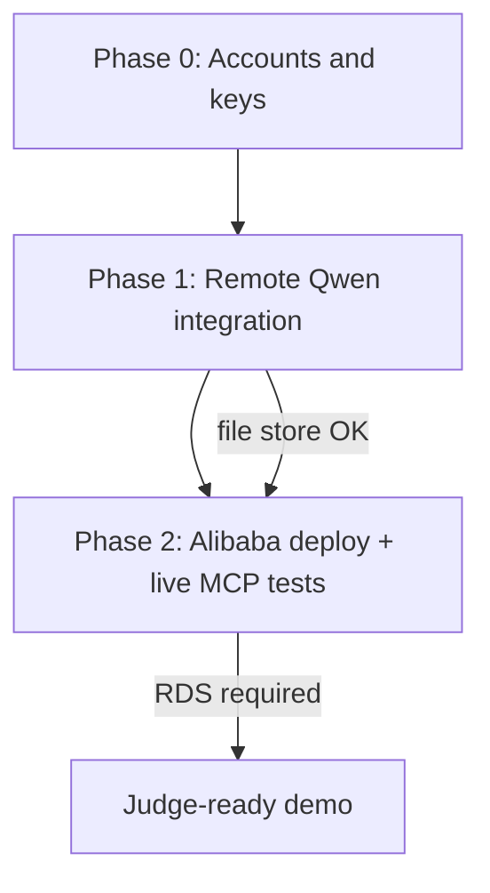

# Testing guide (master index)

End-to-end testing for **Qwen Memory MCP** across two phases: remote Qwen
integration and Alibaba Cloud deployment verification.

All commands run from the **repository root** after `npm install`.

**Repository:** https://github.com/John-CEO-HQ/qwen-memory-mcp

**Hackathon judges:** see [JUDGE-TESTING.md](JUDGE-TESTING.md).

---

## Overview

| Phase | Doc | Needs network | Needs Alibaba compute |
|-------|-----|---------------|----------------------|
| 0 | [CREDENTIALS-AND-SETUP.md](CREDENTIALS-AND-SETUP.md) | Signup only | No |
| 1 | [PHASE1-REMOTE-INTEGRATION.md](PHASE1-REMOTE-INTEGRATION.md) | Yes (DashScope) | No |
| 2 | [PHASE2-DEPLOYMENT-TESTING.md](PHASE2-DEPLOYMENT-TESTING.md) | Yes | Yes (ECS/FC + RDS) |

---

## Command cheat sheet

| Command | Phase | Requires |
|---------|-------|----------|
| `npm test` | Offline unit tests | Nothing (uses fake Qwen) |
| `npm run verify:qwen` | 1 | `QWEN_API_KEY` in `.env` |
| `npm run demo` | 1 offline | Nothing |
| `npm run demo:live` | 1 live | `QWEN_API_KEY` |
| `npm run test:integration` | 1-2 | See per-file env below |
| `npm run verify:deployed` | 2 | `DEPLOYED_MCP_URL`, `MCP_AUTH_TOKEN` |
| `./scripts/smoke-mcp-http.sh` | 2 manual | `BASE_URL`, `MCP_AUTH_TOKEN` env |
| `./scripts/run-integration-server.sh` | 1 local HTTP | `.env` with Qwen key |

### Integration test env matrix

| Test file | Required env |
|-----------|--------------|
| `qwen-remote.integration.test.ts` | `QWEN_API_KEY` |
| `service-qwen.integration.test.ts` | `QWEN_API_KEY` |
| `http-mcp.integration.test.ts` | `QWEN_API_KEY` |
| `mysql-store.integration.test.ts` | `MYSQL_*` |
| `deployed.integration.test.ts` | `DEPLOYED_MCP_URL`, `MCP_AUTH_TOKEN` |

Tests **skip automatically** when env is missing, so `npm run test:integration`
is safe to run without keys (everything skips).

---

## Pass / fail criteria

### Phase 1 - Remote Qwen integration

- [ ] `npm run verify:qwen` prints PASS for embed and analyze
- [ ] `npm run demo:live` completes without error
- [ ] Integration tests for Qwen + service + HTTP pass
- [ ] `/health` shows intelligence label containing `qwen(` not `fake`

### Phase 2 - Deployment testing

- [ ] HTTPS `/health` returns `ok: true`
- [ ] All four MCP tools respond over POST `/mcp`
- [ ] `npm run verify:deployed` PASS
- [ ] Memory survives container restart (proves RDS, not in-memory)
- [ ] Submission links: [`src/qwen.ts`](../src/qwen.ts), [`src/memory/mysql-store.ts`](../src/memory/mysql-store.ts)

---

## Troubleshooting

| Symptom | See |
|---------|-----|
| Wrong npm scripts (parent repo tests run) | [INSTALL.md](INSTALL.md) - npm prefix workaround |
| DashScope 401/403 | [CREDENTIALS-AND-SETUP.md](CREDENTIALS-AND-SETUP.md) - region URL |
| Integration tests all skipped | Set `QWEN_API_KEY` in `.env` |
| Deploy verify fails 401 | Match `MCP_AUTH_TOKEN` locally and on server |
| MySQL connection refused | RDS security group, VPC, credentials |

---

## Related docs

- [CREDENTIALS-AND-SETUP.md](CREDENTIALS-AND-SETUP.md)
- [PHASE1-REMOTE-INTEGRATION.md](PHASE1-REMOTE-INTEGRATION.md)
- [PHASE2-DEPLOYMENT-TESTING.md](PHASE2-DEPLOYMENT-TESTING.md)
- [INSTALL.md](INSTALL.md)
- [JUDGE-TESTING.md](JUDGE-TESTING.md)
